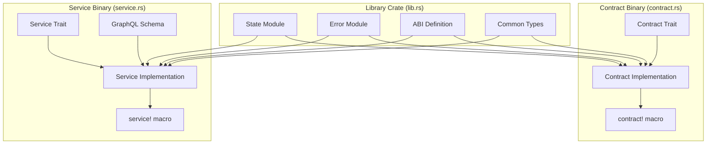

# Linera SDK Integration Fix - Design Document

## Overview

This design document outlines the architectural changes needed to properly integrate the Pine Analytics application with the Linera SDK version 0.15.7. The current implementation has compilation errors due to incorrect trait implementations, missing ABI definitions, and improper module structure. This design provides a complete solution that follows Linera's application patterns and best practices.

The fix involves restructuring the application into three main components:
1. **Library Crate** (`src/lib.rs`): Common types, state definitions, and error handling
2. **Contract Binary** (`src/contract.rs`): State-mutating operations with proper Linera SDK integration
3. **Service Binary** (`src/service.rs`): GraphQL query interface with proper Linera SDK integration

## Architecture

### Current Issues

The existing implementation has several critical problems:

1. **Missing ABI Definitions**: No `WithContractAbi` or `WithServiceAbi` trait implementations
2. **Incorrect Module Structure**: Contract and service trying to use `crate::` imports instead of library imports
3. **Missing Runtime Integration**: Not properly using `ContractRuntime` and `ServiceRuntime`
4. **Improper State Management**: Not using Linera's view system for state persistence
5. **Binary Entry Points**: Missing proper macro invocations for WASM entry points

### Target Architecture



## Components and Interfaces

### 1. Application Binary Interface (ABI)

The ABI defines the interface between the contract and service, and how they communicate with the blockchain.

```rust
// In src/lib.rs

use linera_sdk::{
    base::{ApplicationId, ChainId, Owner},
    Contract, ContractAbi, Service, ServiceAbi,
};
use serde::{Deserialize, Serialize};

/// Application ABI
pub struct AnalyticsAbi;

impl ContractAbi for AnalyticsAbi {
    type Operation = Operation;
    type Response = ();
}

impl ServiceAbi for AnalyticsAbi {
    type Query = Request;
    type QueryResponse = Response;
}

/// Operations that modify contract state
#[derive(Debug, Deserialize, Serialize)]
pub enum Operation {
    AddMonitoredApp {
        application_id: ApplicationId,
        chain_id: ChainId,
        graphql_endpoint: String,
    },
    RemoveMonitoredApp {
        application_id: ApplicationId,
    },
    UpdateAppConfig {
        application_id: ApplicationId,
        config: AppConfig,
    },
    CaptureEvent {
        event: CapturedEvent,
    },
    CaptureTransaction {
        transaction: TransactionRecord,
    },
    UpdateMetric {
        key: MetricKey,
        value: MetricValue,
    },
}

/// Cross-chain messages
#[derive(Debug, Deserialize, Serialize)]
pub enum Message {
    EventNotification {
        event: CapturedEvent,
    },
    TransactionNotification {
        transaction: TransactionRecord,
    },
    Subscribe {
        application_id: ApplicationId,
    },
    Unsubscribe {
        application_id: ApplicationId,
    },
}

/// Service query requests
#[derive(Debug, Deserialize, Serialize)]
pub enum Request {
    GetMonitoredApplications,
    GetApplicationMetrics {
        application_id: String,
        time_range: Option<TimeRange>,
    },
    GetEvents {
        filters: EventFilters,
        pagination: Pagination,
    },
    GetTimeSeries {
        metric: String,
        time_range: TimeRange,
        granularity_ms: u64,
    },
}

/// Service query responses
#[derive(Debug, Deserialize, Serialize)]
pub enum Response {
    MonitoredApplications(Vec<AppConfig>),
    ApplicationMetrics(Vec<(String, MetricValue)>),
    Events(Vec<CapturedEvent>),
    TimeSeries(Vec<TimeSeriesPoint>),
}
```

### 2. State Management with Views

The state uses Linera's view system for efficient blockchain storage.

```rust
// In src/state.rs

use linera_sdk::views::{
    linera_views,
    MapView, QueueView, RegisterView, RootView, View, ViewStorageContext,
};
use linera_sdk::base::{ApplicationId, ChainId, Owner};

/// Application state using Linera views
#[derive(RootView)]
pub struct AnalyticsState<C> {
    /// Admin owner
    pub admin_owner: RegisterView<C, Owner>,
    
    /// Monitored applications configuration
    pub monitored_applications: MapView<C, ApplicationId, AppConfig>,
    
    /// Captured events (append-only)
    pub events: QueueView<C, CapturedEvent>,
    
    /// Aggregated metrics
    pub aggregated_metrics: MapView<C, MetricKey, MetricValue>,
    
    /// Event index by timestamp
    pub event_index: MapView<C, Timestamp, Vec<EventId>>,
    
    /// Event index by application
    pub app_index: MapView<C, ApplicationId, Vec<EventId>>,
    
    /// Next event ID counter
    pub next_event_id: RegisterView<C, EventId>,
}

/// Application configuration
#[derive(Debug, Clone, Deserialize, Serialize)]
pub struct AppConfig {
    pub application_id: ApplicationId,
    pub chain_id: ChainId,
    pub graphql_endpoint: String,
    pub enabled: bool,
    pub custom_metrics: Vec<MetricDefinition>,
}

/// Captured event data
#[derive(Debug, Clone, Deserialize, Serialize)]
pub struct CapturedEvent {
    pub id: EventId,
    pub source_app: ApplicationId,
    pub source_chain: ChainId,
    pub timestamp: Timestamp,
    pub event_type: String,
    pub data: serde_json::Value,
    pub transaction_hash: String,
}

// Additional type definitions...
pub type EventId = u64;
pub type MetricKey = String;
pub type Timestamp = u64;

#[derive(Debug, Clone, Deserialize, Serialize)]
pub enum MetricValue {
    Counter(u64),
    Gauge(f64),
    Histogram(Vec<f64>),
    Summary { sum: f64, count: u64, avg: f64 },
}
```

### 3. Contract Implementation

The contract handles state mutations and cross-chain messages.

```rust
// In src/contract.rs

use pine_analytics::{
    AnalyticsAbi, AnalyticsState, AppConfig, CapturedEvent, Message, MetricKey,
    MetricValue, Operation, TransactionRecord, AnalyticsError, Result,
};
use linera_sdk::{
    base::{ApplicationId, ChainId, Owner, WithContractAbi},
    Contract, ContractRuntime,
};

/// Analytics contract
pub struct AnalyticsContract {
    state: AnalyticsState,
    runtime: ContractRuntime<Self>,
}

impl WithContractAbi for AnalyticsContract {
    type Abi = AnalyticsAbi;
}

impl Contract for AnalyticsContract {
    type Message = Message;
    type InstantiationArgument = Owner;
    type Parameters = ();

    async fn load(runtime: ContractRuntime<Self>) -> Self {
        let state = AnalyticsState::load(runtime.root_view_storage_context())
            .await
            .expect("Failed to load state");
        Self { state, runtime }
    }

    async fn instantiate(&mut self, admin_owner: Owner) {
        self.state.admin_owner.set(admin_owner);
    }

    async fn execute_operation(&mut self, operation: Operation) -> Self::Response {
        match operation {
            Operation::AddMonitoredApp {
                application_id,
                chain_id,
                graphql_endpoint,
            } => {
                self.add_monitored_app(application_id, chain_id, graphql_endpoint)
                    .await
            }
            Operation::RemoveMonitoredApp { application_id } => {
                self.remove_monitored_app(application_id).await
            }
            Operation::UpdateAppConfig {
                application_id,
                config,
            } => self.update_app_config(application_id, config).await,
            Operation::CaptureEvent { event } => self.capture_event(event).await,
            Operation::CaptureTransaction { transaction } => {
                self.capture_transaction(transaction).await
            }
            Operation::UpdateMetric { key, value } => {
                self.update_metric(key, value).await
            }
        }
    }

    async fn execute_message(&mut self, message: Message) {
        match message {
            Message::EventNotification { event } => {
                let _ = self.capture_event(event).await;
            }
            Message::TransactionNotification { transaction } => {
                let _ = self.capture_transaction(transaction).await;
            }
            Message::Subscribe { application_id } => {
                log::info!("Subscription established for app: {}", application_id);
            }
            Message::Unsubscribe { application_id } => {
                log::info!("Unsubscribed from app: {}", application_id);
            }
        }
    }

    async fn store(mut self) {
        self.state.save().await.expect("Failed to save state");
    }
}

// Implementation methods
impl AnalyticsContract {
    async fn add_monitored_app(
        &mut self,
        application_id: ApplicationId,
        chain_id: ChainId,
        graphql_endpoint: String,
    ) -> Result<()> {
        let config = AppConfig {
            application_id: application_id.clone(),
            chain_id,
            graphql_endpoint,
            enabled: true,
            custom_metrics: vec![],
        };
        
        self.state
            .monitored_applications
            .insert(&application_id, config)?;
        
        log::info!("Added monitored application: {}", application_id);
        Ok(())
    }

    async fn remove_monitored_app(&mut self, application_id: ApplicationId) -> Result<()> {
        self.state.monitored_applications.remove(&application_id)?;
        log::info!("Removed monitored application: {}", application_id);
        Ok(())
    }

    async fn update_app_config(
        &mut self,
        application_id: ApplicationId,
        config: AppConfig,
    ) -> Result<()> {
        self.state
            .monitored_applications
            .insert(&application_id, config)?;
        log::info!("Updated config for application: {}", application_id);
        Ok(())
    }

    async fn capture_event(&mut self, mut event: CapturedEvent) -> Result<()> {
        // Assign event ID
        let next_id = self.state.next_event_id.get();
        event.id = next_id;
        self.state.next_event_id.set(next_id + 1);
        
        // Store event
        self.state.events.push_back(event.clone());
        
        // Update indexes
        self.update_event_indexes(&event).await?;
        
        log::info!("Captured event {} from app {}", event.id, event.source_app);
        Ok(())
    }

    async fn capture_transaction(&mut self, transaction: TransactionRecord) -> Result<()> {
        log::info!("Captured transaction {}", transaction.hash);
        Ok(())
    }

    async fn update_metric(&mut self, key: MetricKey, value: MetricValue) -> Result<()> {
        self.state.aggregated_metrics.insert(&key, value)?;
        Ok(())
    }

    async fn update_event_indexes(&mut self, event: &CapturedEvent) -> Result<()> {
        // Update time index
        let mut time_events = self
            .state
            .event_index
            .get(&event.timestamp)
            .await?
            .unwrap_or_default();
        time_events.push(event.id);
        self.state.event_index.insert(&event.timestamp, time_events)?;
        
        // Update app index
        let mut app_events = self
            .state
            .app_index
            .get(&event.source_app)
            .await?
            .unwrap_or_default();
        app_events.push(event.id);
        self.state.app_index.insert(&event.source_app, app_events)?;
        
        Ok(())
    }
}

linera_sdk::contract!(AnalyticsContract);
```

### 4. Service Implementation

The service provides GraphQL queries for reading application state.

```rust
// In src/service.rs

use pine_analytics::{
    AnalyticsAbi, AnalyticsState, AppConfig, CapturedEvent, EventFilters, MetricValue,
    Pagination, Request, Response, TimeRange, TimeSeriesPoint,
};
use async_graphql::{Context, EmptySubscription, Object, Schema, SimpleObject};
use linera_sdk::{
    base::WithServiceAbi, Service, ServiceRuntime,
};
use std::sync::Arc;

/// Analytics service
pub struct AnalyticsService {
    state: Arc<AnalyticsState>,
}

impl WithServiceAbi for AnalyticsService {
    type Abi = AnalyticsAbi;
}

impl Service for AnalyticsService {
    type Parameters = ();

    async fn load(runtime: ServiceRuntime<Self>) -> Self {
        let state = AnalyticsState::load(runtime.root_view_storage_context())
            .await
            .expect("Failed to load state");
        Self {
            state: Arc::new(state),
        }
    }

    async fn handle_query(&self, request: Request) -> Response {
        match request {
            Request::GetMonitoredApplications => {
                let apps = self.get_monitored_applications().await;
                Response::MonitoredApplications(apps)
            }
            Request::GetApplicationMetrics {
                application_id,
                time_range,
            } => {
                let metrics = self
                    .get_application_metrics(&application_id, time_range)
                    .await;
                Response::ApplicationMetrics(metrics)
            }
            Request::GetEvents {
                filters,
                pagination,
            } => {
                let events = self.get_events(filters, pagination).await;
                Response::Events(events)
            }
            Request::GetTimeSeries {
                metric,
                time_range,
                granularity_ms,
            } => {
                let series = self
                    .get_time_series(&metric, time_range, granularity_ms)
                    .await;
                Response::TimeSeries(series)
            }
        }
    }
}

// Query implementation methods
impl AnalyticsService {
    async fn get_monitored_applications(&self) -> Vec<AppConfig> {
        let mut apps = Vec::new();
        self.state
            .monitored_applications
            .for_each_index_value(|_key, value| {
                apps.push(value.clone());
                Ok(())
            })
            .await
            .expect("Failed to iterate applications");
        apps
    }

    async fn get_application_metrics(
        &self,
        application_id: &str,
        _time_range: Option<TimeRange>,
    ) -> Vec<(String, MetricValue)> {
        let mut metrics = Vec::new();
        self.state
            .aggregated_metrics
            .for_each_index_value(|key, value| {
                if key.starts_with(application_id) {
                    metrics.push((key.clone(), value.clone()));
                }
                Ok(())
            })
            .await
            .expect("Failed to iterate metrics");
        metrics
    }

    async fn get_events(
        &self,
        _filters: EventFilters,
        _pagination: Pagination,
    ) -> Vec<CapturedEvent> {
        let mut events = Vec::new();
        self.state
            .events
            .elements()
            .await
            .expect("Failed to get events")
            .into_iter()
            .for_each(|event| {
                events.push(event);
            });
        events
    }

    async fn get_time_series(
        &self,
        _metric: &str,
        time_range: TimeRange,
        granularity_ms: u64,
    ) -> Vec<TimeSeriesPoint> {
        let mut points = Vec::new();
        let mut current = time_range.start;
        
        while current <= time_range.end {
            points.push(TimeSeriesPoint {
                timestamp: current,
                value: MetricValue::Counter(0),
            });
            current += granularity_ms;
        }
        
        points
    }
}

linera_sdk::service!(AnalyticsService);
```

### 5. Error Handling

Proper error types compatible with Linera SDK.

```rust
// In src/error.rs

use thiserror::Error;

#[derive(Debug, Error)]
pub enum AnalyticsError {
    #[error("Application not found: {0}")]
    ApplicationNotFound(String),
    
    #[error("Invalid GraphQL endpoint: {0}")]
    InvalidEndpoint(String),
    
    #[error("Event processing failed: {0}")]
    EventProcessingError(String),
    
    #[error("Query execution failed: {0}")]
    QueryError(String),
    
    #[error("Unauthorized operation")]
    Unauthorized,
    
    #[error("Invalid metric definition: {0}")]
    InvalidMetric(String),
    
    #[error("Storage error: {0}")]
    StorageError(String),
    
    #[error("View error: {0}")]
    ViewError(#[from] linera_views::views::ViewError),
}

pub type Result<T> = std::result::Result<T, AnalyticsError>;
```

## Data Models

### Type Definitions

```rust
// Additional types in src/lib.rs

pub type EventId = u64;
pub type MetricKey = String;
pub type Timestamp = u64;

#[derive(Debug, Clone, Deserialize, Serialize)]
pub struct TransactionRecord {
    pub hash: String,
    pub chain_id: ChainId,
    pub timestamp: Timestamp,
}

#[derive(Debug, Clone, Deserialize, Serialize)]
pub struct MetricDefinition {
    pub name: String,
    pub description: String,
    pub metric_type: MetricType,
    pub extraction_path: String,
}

#[derive(Debug, Clone, Deserialize, Serialize)]
pub enum MetricType {
    Counter,
    Gauge,
    Histogram,
    Summary,
}

#[derive(Debug, Clone, Deserialize, Serialize)]
pub struct EventFilters {
    pub application_ids: Option<Vec<ApplicationId>>,
    pub event_types: Option<Vec<String>>,
    pub time_range: Option<TimeRange>,
}

#[derive(Debug, Clone, Deserialize, Serialize)]
pub struct TimeRange {
    pub start: Timestamp,
    pub end: Timestamp,
}

#[derive(Debug, Clone, Deserialize, Serialize)]
pub struct Pagination {
    pub offset: usize,
    pub limit: usize,
}

#[derive(Debug, Clone, Deserialize, Serialize)]
pub struct TimeSeriesPoint {
    pub timestamp: Timestamp,
    pub value: MetricValue,
}
```

## Correctness Properties

*A property is a characteristic or behavior that should hold true across all valid executions of a system—essentially, a formal statement about what the system should do. Properties serve as the bridge between human-readable specifications and machine-verifiable correctness guarantees.*

### Property 1: State persistence round-trip

*For any* application state with modified fields, saving the state and then loading it should restore all field values exactly.

**Validates: Requirements 3.3, 3.4**

### Property 2: Runtime state access consistency

*For any* contract operation that reads state through the ContractRuntime, the returned data should match the current blockchain state.

**Validates: Requirements 1.5**

### Property 3: Service runtime state access consistency

*For any* service query that reads state through the ServiceRuntime, the returned data should match the current blockchain state.

**Validates: Requirements 2.5**

### Property 4: GraphQL query state consistency

*For any* GraphQL query executed by the service, the returned data should match the current application state accessible through the runtime.

**Validates: Requirements 6.2, 6.3**

### Property 5: Error propagation without panics

*For any* operation that encounters an error condition, the contract should return a Result::Err rather than panicking.

**Validates: Requirements 7.3**

### Property 6: GraphQL error handling

*For any* query that encounters an error condition, the service should return a GraphQL error response rather than panicking.

**Validates: Requirements 6.5, 7.4**

## Testing Strategy

### Unit Testing

Unit tests verify individual components work correctly in isolation.

**Test Coverage Areas**:
- ABI type definitions compile correctly
- State view operations (insert, get, remove)
- Error type conversions
- Module imports and exports

**Example Unit Tests**:

```rust
#[cfg(test)]
mod tests {
    use super::*;
    
    #[test]
    fn test_abi_types_defined() {
        // Verify ABI types exist and implement required traits
        let _: AnalyticsAbi = AnalyticsAbi;
    }
    
    #[test]
    fn test_operation_serialization() {
        let op = Operation::AddMonitoredApp {
            application_id: ApplicationId::default(),
            chain_id: ChainId::default(),
            graphql_endpoint: "http://localhost:8080".to_string(),
        };
        
        let serialized = serde_json::to_string(&op).unwrap();
        let deserialized: Operation = serde_json::from_str(&serialized).unwrap();
        
        // Verify round-trip
        assert!(matches!(deserialized, Operation::AddMonitoredApp { .. }));
    }
    
    #[test]
    fn test_error_types() {
        let error = AnalyticsError::ApplicationNotFound("test".to_string());
        assert_eq!(
            error.to_string(),
            "Application not found: test"
        );
    }
}
```

### Property-Based Testing

Property-based tests verify universal properties hold across all inputs using `proptest`.

**Testing Framework**: `proptest` version 1.0

```rust
use proptest::prelude::*;

proptest! {
    // Properties will be implemented based on the correctness properties above
    
    #[test]
    fn test_state_round_trip(
        admin_owner in any::<Owner>(),
        app_id in any::<ApplicationId>()
    ) {
        // Property 1: State persistence round-trip
        // Test that saving and loading state preserves all values
    }
    
    #[test]
    fn test_error_no_panic(
        invalid_endpoint in ".*"
    ) {
        // Property 5: Error propagation without panics
        // Test that invalid inputs return errors rather than panicking
    }
}
```

### Integration Testing

Integration tests verify the contract and service work together correctly.

```rust
#[tokio::test]
async fn test_contract_service_integration() {
    // Deploy contract
    let contract = deploy_test_contract().await;
    
    // Execute operation
    contract
        .execute_operation(Operation::AddMonitoredApp {
            application_id: test_app_id(),
            chain_id: test_chain_id(),
            graphql_endpoint: "http://localhost:8080".to_string(),
        })
        .await
        .expect("Operation should succeed");
    
    // Query through service
    let service = load_test_service().await;
    let response = service
        .handle_query(Request::GetMonitoredApplications)
        .await;
    
    // Verify data consistency
    match response {
        Response::MonitoredApplications(apps) => {
            assert_eq!(apps.len(), 1);
            assert_eq!(apps[0].application_id, test_app_id());
        }
        _ => panic!("Unexpected response type"),
    }
}
```

### Compilation Testing

Verify the application compiles successfully for all targets.

```bash
# Test native compilation
cargo build --release

# Test WASM compilation
cargo build --release --target wasm32-unknown-unknown

# Test with all features
cargo build --release --all-features

# Check for warnings
cargo clippy -- -D warnings
```

## Error Handling

### Error Recovery Strategies

1. **View Errors**: Log and propagate to caller
2. **Serialization Errors**: Return descriptive error messages
3. **Invalid Operations**: Validate inputs before execution
4. **Query Failures**: Return partial results with error indication

### Logging Strategy

```rust
use log::{debug, info, warn, error};

// Log levels:
// - ERROR: Critical failures requiring immediate attention
// - WARN: Recoverable errors or degraded performance
// - INFO: Important state changes and operations
// - DEBUG: Detailed execution flow for troubleshooting

impl AnalyticsContract {
    async fn capture_event(&mut self, event: CapturedEvent) -> Result<()> {
        info!("Processing event {} from app {}", event.id, event.source_app);
        
        match self.update_event_indexes(&event).await {
            Ok(_) => {
                debug!("Event {} indexed successfully", event.id);
                Ok(())
            }
            Err(e) => {
                error!("Failed to index event {}: {}", event.id, e);
                Err(e)
            }
        }
    }
}
```

## Performance Considerations

### View System Optimization

- Use `MapView` for key-value lookups (O(log n))
- Use `QueueView` for append-only event storage (O(1) append)
- Use `RegisterView` for single values (O(1) access)
- Batch view operations when possible to reduce storage calls

### Query Optimization

- Implement pagination for large result sets
- Use indexes for efficient filtering
- Cache frequently accessed data in service
- Limit result set sizes to prevent memory exhaustion

## Deployment Strategy

### Build Process

```bash
# Clean previous builds
cargo clean

# Build for WASM target
cargo build --release --target wasm32-unknown-unknown

# Verify binaries exist
ls target/wasm32-unknown-unknown/release/pine_analytics_contract.wasm
ls target/wasm32-unknown-unknown/release/pine_analytics_service.wasm
```

### Linera Deployment

```bash
# Publish bytecode
linera publish-bytecode \
    target/wasm32-unknown-unknown/release/pine_analytics_contract.wasm \
    target/wasm32-unknown-unknown/release/pine_analytics_service.wasm

# Create application instance
linera create-application <bytecode-id> \
    --json-argument '"<admin-owner-address>"'

# Start GraphQL service
linera service --port 8080
```

## Dependencies

### Cargo.toml Configuration

```toml
[package]
name = "pine-analytics"
version = "0.1.0"
edition = "2021"

[dependencies]
linera-sdk = "=0.15.7"
async-graphql = "=7.0.17"
serde = { version = "1.0", features = ["derive"] }
serde_json = "1.0"
tokio = { version = "1.40", features = ["rt", "sync"] }
futures = "0.3"
log = "0.4.27"
thiserror = "1.0"

[dev-dependencies]
proptest = "1.0"
tokio-test = "0.4"

[[bin]]
name = "pine_analytics_contract"
path = "src/contract.rs"

[[bin]]
name = "pine_analytics_service"
path = "src/service.rs"

[lib]
path = "src/lib.rs"
```

### Rust Toolchain

```toml
[toolchain]
channel = "1.89.0"
components = ["rustfmt", "clippy"]
targets = ["wasm32-unknown-unknown"]
profile = "minimal"
```

## Migration Path

### Step-by-Step Migration

1. **Create ABI Definition**: Define `AnalyticsAbi` with trait implementations
2. **Update State Module**: Convert to view-based state management
3. **Refactor Contract**: Implement `Contract` trait with proper runtime usage
4. **Refactor Service**: Implement `Service` trait with proper runtime usage
5. **Update Library**: Export all types from `lib.rs`
6. **Fix Imports**: Change `crate::` to `pine_analytics::` in binaries
7. **Add Macros**: Include `linera_sdk::contract!` and `linera_sdk::service!`
8. **Test Compilation**: Verify all targets compile successfully
9. **Run Tests**: Execute unit and integration tests
10. **Deploy**: Build WASM and deploy to Linera

## Conclusion

This design provides a complete solution for integrating the Pine Analytics application with the Linera SDK. By following Linera's application patterns, using the view system for state management, and properly implementing the required traits, the application will compile successfully and function correctly on the Linera blockchain.

The key changes are:
- Proper ABI definitions with trait implementations
- View-based state management for blockchain persistence
- Correct runtime usage in contract and service
- Proper module structure with library crate
- WASM entry points generated by SDK macros

This design ensures the application follows Linera best practices and will be maintainable and extensible for future enhancements.
