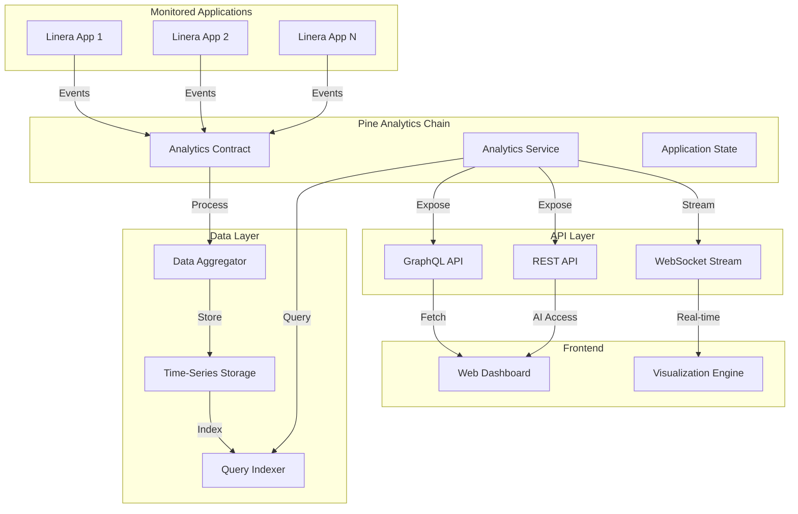

# Pine Analytics - Design Document

## Overview

Pine Analytics is a full-stack blockchain analytics platform built on the Linera blockchain that provides real-time data capture, aggregation, interpretation, and visualization capabilities. The system is designed as a Linera application that monitors other Linera applications, capturing on-chain events and transactions, processing them into structured insights, and exposing both human-readable visualizations and machine-readable APIs.

The platform follows Linera's microchain architecture where each analytics instance runs on its own chain, subscribing to events from monitored applications via cross-chain messages. The design leverages Linera's GraphQL service layer for both data ingestion (subscribing to other apps) and data exposure (serving analytics queries).

### Key Design Principles

1. **Real-Time Processing**: Leverage Linera's fast finality for sub-second data capture
2. **Scalability**: Use Linera's microchain architecture for horizontal scaling
3. **Composability**: Design as a reusable analytics service that any Linera app can integrate
4. **Data Integrity**: Ensure all captured data is cryptographically verifiable via blockchain state
5. **Performance**: Optimize for high-throughput data ingestion and low-latency queries

## Architecture

### High-Level Architecture



### Component Architecture

The system is organized into four main layers:

1. **Contract Layer**: Linera smart contract handling state management and event processing
2. **Service Layer**: GraphQL service providing query interfaces and subscriptions
3. **Data Processing Layer**: Aggregation, transformation, and storage logic
4. **Presentation Layer**: Web dashboard and visualization components

### Linera Application Structure

Following Linera's standard application pattern:

```
pine-analytics/
├── src/
│   ├── contract.rs       # Contract logic (state mutations)
│   ├── service.rs        # GraphQL service (queries)
│   └── state.rs          # Application state definitions
├── Cargo.toml
└── build.rs
```

## Components and Interfaces

### 1. Analytics Contract (`contract.rs`)

The contract handles all state-changing operations and event processing.

#### State Structure

```rust
#[derive(Debug, Deserialize, Serialize)]
pub struct AnalyticsState {
    // Configuration
    pub monitored_applications: BTreeMap<ApplicationId, AppConfig>,
    pub admin_owner: Owner,
    
    // Data storage
    pub events: Vec<CapturedEvent>,
    pub transactions: Vec<TransactionRecord>,
    pub aggregated_metrics: BTreeMap<MetricKey, MetricValue>,
    
    // Indexing
    pub event_index: BTreeMap<Timestamp, Vec<EventId>>,
    pub app_index: BTreeMap<ApplicationId, Vec<EventId>>,
}

#[derive(Debug, Deserialize, Serialize)]
pub struct AppConfig {
    pub application_id: ApplicationId,
    pub chain_id: ChainId,
    pub graphql_endpoint: String,
    pub enabled: bool,
    pub custom_metrics: Vec<MetricDefinition>,
}

#[derive(Debug, Deserialize, Serialize)]
pub struct CapturedEvent {
    pub id: EventId,
    pub source_app: ApplicationId,
    pub source_chain: ChainId,
    pub timestamp: Timestamp,
    pub event_type: String,
    pub data: serde_json::Value,
    pub transaction_hash: CryptoHash,
}

#[derive(Debug, Deserialize, Serialize)]
pub struct TransactionRecord {
    pub hash: CryptoHash,
    pub chain_id: ChainId,
    pub block_height: BlockHeight,
    pub timestamp: Timestamp,
    pub sender: Owner,
    pub operations: Vec<Operation>,
}
```

#### Operations

```rust
#[derive(Debug, Deserialize, Serialize)]
pub enum Operation {
    // Configuration operations
    AddMonitoredApp {
        application_id: ApplicationId,
        chain_id: ChainId,
        graphql_endpoint: String,
    },
    RemoveMonitoredApp {
        application_id: ApplicationId,
    },
    UpdateAppConfig {
        application_id: ApplicationId,
        config: AppConfig,
    },
    
    // Data ingestion operations
    CaptureEvent {
        event: CapturedEvent,
    },
    CaptureTransaction {
        transaction: TransactionRecord,
    },
    
    // Aggregation operations
    UpdateMetric {
        key: MetricKey,
        value: MetricValue,
    },
}
```

#### Message Handling

```rust
#[derive(Debug, Deserialize, Serialize)]
pub enum Message {
    // Cross-chain messages from monitored apps
    EventNotification {
        event: CapturedEvent,
    },
    TransactionNotification {
        transaction: TransactionRecord,
    },
    
    // Subscription management
    Subscribe {
        application_id: ApplicationId,
    },
    Unsubscribe {
        application_id: ApplicationId,
    },
}
```

### 2. Analytics Service (`service.rs`)

The service provides GraphQL queries and subscriptions for data access.

#### GraphQL Schema

```rust
use async_graphql::{Context, Object, Schema, Subscription};

pub struct QueryRoot;

#[Object]
impl QueryRoot {
    // Application queries
    async fn monitored_applications(&self, ctx: &Context<'_>) -> Vec<AppConfig> {
        // Return list of monitored applications
    }
    
    async fn application_metrics(
        &self,
        ctx: &Context<'_>,
        application_id: String,
        time_range: Option<TimeRange>,
    ) -> Vec<Metric> {
        // Return metrics for specific application
    }
    
    // Event queries
    async fn events(
        &self,
        ctx: &Context<'_>,
        filters: EventFilters,
        pagination: Pagination,
    ) -> EventConnection {
        // Return filtered events with pagination
    }
    
    async fn event_by_id(&self, ctx: &Context<'_>, id: String) -> Option<CapturedEvent> {
        // Return specific event
    }
    
    // Transaction queries
    async fn transactions(
        &self,
        ctx: &Context<'_>,
        filters: TransactionFilters,
        pagination: Pagination,
    ) -> TransactionConnection {
        // Return filtered transactions
    }
    
    // Aggregation queries
    async fn time_series(
        &self,
        ctx: &Context<'_>,
        metric: String,
        time_range: TimeRange,
        granularity: TimeGranularity,
    ) -> Vec<TimeSeriesPoint> {
        // Return time-series data
    }
    
    async fn compare_applications(
        &self,
        ctx: &Context<'_>,
        application_ids: Vec<String>,
        metrics: Vec<String>,
    ) -> ComparisonResult {
        // Return comparative metrics
    }
}

pub struct MutationRoot;

#[Object]
impl MutationRoot {
    async fn add_monitored_application(
        &self,
        ctx: &Context<'_>,
        application_id: String,
        chain_id: String,
        graphql_endpoint: String,
    ) -> Result<AppConfig> {
        // Add new application to monitor
    }
    
    async fn remove_monitored_application(
        &self,
        ctx: &Context<'_>,
        application_id: String,
    ) -> Result<bool> {
        // Remove application from monitoring
    }
    
    async fn define_custom_metric(
        &self,
        ctx: &Context<'_>,
        application_id: String,
        metric: MetricDefinition,
    ) -> Result<MetricDefinition> {
        // Define custom metric for application
    }
}

pub struct SubscriptionRoot;

#[Subscription]
impl SubscriptionRoot {
    async fn event_stream(
        &self,
        ctx: &Context<'_>,
        filters: Option<EventFilters>,
    ) -> impl Stream<Item = CapturedEvent> {
        // Stream real-time events
    }
    
    async fn metric_updates(
        &self,
        ctx: &Context<'_>,
        metric: String,
    ) -> impl Stream<Item = MetricValue> {
        // Stream real-time metric updates
    }
}
```

### 3. Data Aggregator

The aggregator processes raw events into structured metrics.

```rust
pub struct DataAggregator {
    state: Arc<RwLock<AnalyticsState>>,
}

impl DataAggregator {
    pub async fn process_event(&self, event: CapturedEvent) -> Result<()> {
        // Extract metrics from event
        let metrics = self.extract_metrics(&event)?;
        
        // Update aggregated metrics
        for (key, value) in metrics {
            self.update_metric(key, value).await?;
        }
        
        // Update indexes
        self.update_indexes(&event).await?;
        
        Ok(())
    }
    
    fn extract_metrics(&self, event: &CapturedEvent) -> Result<Vec<(MetricKey, MetricValue)>> {
        // Parse event data and extract relevant metrics
        // Support custom metric definitions per application
    }
    
    async fn update_metric(&self, key: MetricKey, value: MetricValue) -> Result<()> {
        // Update metric with aggregation logic (sum, avg, count, etc.)
    }
    
    async fn update_indexes(&self, event: &CapturedEvent) -> Result<()> {
        // Update time-based and application-based indexes
    }
}
```

### 4. Query Indexer

Optimizes query performance through indexing strategies.

```rust
pub struct QueryIndexer {
    // Time-series index for efficient range queries
    time_index: BTreeMap<Timestamp, Vec<EventId>>,
    
    // Application index for filtering by source
    app_index: BTreeMap<ApplicationId, Vec<EventId>>,
    
    // Transaction hash index for lookups
    tx_index: BTreeMap<CryptoHash, TransactionRecord>,
    
    // Metric cache for fast aggregation queries
    metric_cache: LruCache<MetricKey, MetricValue>,
}

impl QueryIndexer {
    pub fn query_events(&self, filters: &EventFilters) -> Vec<EventId> {
        // Use indexes to efficiently filter events
    }
    
    pub fn query_time_range(&self, start: Timestamp, end: Timestamp) -> Vec<EventId> {
        // Range query on time index
    }
    
    pub fn get_cached_metric(&self, key: &MetricKey) -> Option<MetricValue> {
        // Fast metric lookup from cache
    }
}
```

### 5. Frontend Dashboard

React-based web application for visualization.

#### Component Structure

```typescript
// Main dashboard component
interface DashboardProps {
  chainId: string;
  applicationId: string;
}

const Dashboard: React.FC<DashboardProps> = ({ chainId, applicationId }) => {
  // Apollo Client for GraphQL queries
  const client = useApolloClient();
  
  return (
    <div className="dashboard">
      <Header />
      <ApplicationSelector />
      <MetricsOverview />
      <TimeSeriesCharts />
      <EventStream />
      <ComparisonView />
    </div>
  );
};

// Time-series chart component
const TimeSeriesChart: React.FC<TimeSeriesProps> = ({ metric, timeRange }) => {
  const { data, loading } = useQuery(TIME_SERIES_QUERY, {
    variables: { metric, timeRange },
  });
  
  return (
    <Chart
      data={data?.timeSeries}
      type="line"
      xAxis="timestamp"
      yAxis="value"
    />
  );
};

// Real-time event stream
const EventStream: React.FC = () => {
  const { data } = useSubscription(EVENT_STREAM_SUBSCRIPTION);
  
  return (
    <div className="event-stream">
      {data?.eventStream.map(event => (
        <EventCard key={event.id} event={event} />
      ))}
    </div>
  );
};
```

## Data Models

### Core Data Types

```rust
// Unique identifiers
pub type EventId = u64;
pub type MetricKey = String;

// Time representation
pub type Timestamp = u64; // Unix timestamp in milliseconds

// Metric value types
#[derive(Debug, Deserialize, Serialize)]
pub enum MetricValue {
    Counter(u64),
    Gauge(f64),
    Histogram(Vec<f64>),
    Summary { sum: f64, count: u64, avg: f64 },
}

// Metric definition for custom metrics
#[derive(Debug, Deserialize, Serialize)]
pub struct MetricDefinition {
    pub name: String,
    pub description: String,
    pub metric_type: MetricType,
    pub extraction_path: String, // JSON path for extracting value
    pub aggregation: AggregationType,
}

#[derive(Debug, Deserialize, Serialize)]
pub enum MetricType {
    Counter,
    Gauge,
    Histogram,
    Summary,
}

#[derive(Debug, Deserialize, Serialize)]
pub enum AggregationType {
    Sum,
    Average,
    Min,
    Max,
    Count,
}

// Query filters
#[derive(Debug, Deserialize, Serialize)]
pub struct EventFilters {
    pub application_ids: Option<Vec<ApplicationId>>,
    pub event_types: Option<Vec<String>>,
    pub time_range: Option<TimeRange>,
    pub transaction_hash: Option<CryptoHash>,
}

#[derive(Debug, Deserialize, Serialize)]
pub struct TimeRange {
    pub start: Timestamp,
    pub end: Timestamp,
}

#[derive(Debug, Deserialize, Serialize)]
pub struct Pagination {
    pub offset: usize,
    pub limit: usize,
}

// Time-series data point
#[derive(Debug, Deserialize, Serialize)]
pub struct TimeSeriesPoint {
    pub timestamp: Timestamp,
    pub value: MetricValue,
}

// Comparison result
#[derive(Debug, Deserialize, Serialize)]
pub struct ComparisonResult {
    pub applications: Vec<ApplicationId>,
    pub metrics: BTreeMap<String, Vec<MetricValue>>,
    pub relative_performance: BTreeMap<ApplicationId, f64>,
}
```

### State Persistence

Linera applications use `linera-views` for state management:

```rust
use linera_views::{
    views::{MapView, QueueView, RegisterView},
    View,
};

#[derive(Debug, View)]
pub struct AnalyticsView {
    // Configuration
    pub monitored_apps: MapView<ApplicationId, AppConfig>,
    pub admin: RegisterView<Owner>,
    
    // Event storage (append-only)
    pub events: QueueView<CapturedEvent>,
    
    // Metrics (mutable)
    pub metrics: MapView<MetricKey, MetricValue>,
    
    // Indexes
    pub time_index: MapView<Timestamp, Vec<EventId>>,
    pub app_index: MapView<ApplicationId, Vec<EventId>>,
}
```

## Error Handling

### Error Types

```rust
#[derive(Debug, Error)]
pub enum AnalyticsError {
    #[error("Application not found: {0}")]
    ApplicationNotFound(ApplicationId),
    
    #[error("Invalid GraphQL endpoint: {0}")]
    InvalidEndpoint(String),
    
    #[error("Event processing failed: {0}")]
    EventProcessingError(String),
    
    #[error("Query execution failed: {0}")]
    QueryError(String),
    
    #[error("Unauthorized operation")]
    Unauthorized,
    
    #[error("Invalid metric definition: {0}")]
    InvalidMetric(String),
    
    #[error("Storage error: {0}")]
    StorageError(String),
    
    #[error("Serialization error: {0}")]
    SerializationError(#[from] serde_json::Error),
}

pub type Result<T> = std::result::Result<T, AnalyticsError>;
```

### Error Recovery

1. **Event Processing Failures**: Log error, skip event, continue processing
2. **Query Failures**: Return partial results with error indication
3. **Network Failures**: Implement retry logic with exponential backoff
4. **State Corruption**: Validate state on load, rebuild indexes if needed

### Logging Strategy

```rust
use log::{debug, info, warn, error};

// Log levels:
// - ERROR: Critical failures requiring immediate attention
// - WARN: Recoverable errors or degraded performance
// - INFO: Important state changes and operations
// - DEBUG: Detailed execution flow for troubleshooting

impl AnalyticsContract {
    pub async fn process_event(&mut self, event: CapturedEvent) -> Result<()> {
        info!("Processing event {} from app {}", event.id, event.source_app);
        
        match self.aggregator.process_event(event.clone()).await {
            Ok(_) => {
                debug!("Event {} processed successfully", event.id);
                Ok(())
            }
            Err(e) => {
                error!("Failed to process event {}: {}", event.id, e);
                Err(e)
            }
        }
    }
}
```

## Testing Strategy

### Unit Testing

Unit tests verify individual components and functions work correctly in isolation.

**Test Coverage Areas**:
- Data model serialization/deserialization
- Metric extraction logic
- Aggregation calculations
- Index operations
- Query filtering logic

**Example Unit Tests**:

```rust
#[cfg(test)]
mod tests {
    use super::*;
    
    #[test]
    fn test_metric_aggregation() {
        let mut aggregator = DataAggregator::new();
        
        // Test counter aggregation
        aggregator.update_metric("tx_count", MetricValue::Counter(1));
        aggregator.update_metric("tx_count", MetricValue::Counter(1));
        
        let result = aggregator.get_metric("tx_count");
        assert_eq!(result, MetricValue::Counter(2));
    }
    
    #[test]
    fn test_time_range_query() {
        let indexer = QueryIndexer::new();
        
        // Add events with timestamps
        indexer.index_event(event1); // t=100
        indexer.index_event(event2); // t=200
        indexer.index_event(event3); // t=300
        
        let results = indexer.query_time_range(150, 250);
        assert_eq!(results.len(), 1);
        assert_eq!(results[0], event2.id);
    }
    
    #[test]
    fn test_event_filtering() {
        let filters = EventFilters {
            application_ids: Some(vec![app1_id]),
            event_types: Some(vec!["Transfer".to_string()]),
            time_range: None,
            transaction_hash: None,
        };
        
        let results = query_events(&filters);
        assert!(results.iter().all(|e| e.source_app == app1_id));
        assert!(results.iter().all(|e| e.event_type == "Transfer"));
    }
}
```

### Property-Based Testing

Property-based tests verify universal properties hold across all inputs using a PBT library.

**Testing Framework**: We'll use `proptest` for Rust property-based testing.

```rust
use proptest::prelude::*;

proptest! {
    // Properties will be defined after prework analysis
}
```

### Integration Testing

Integration tests verify components work together correctly:

```rust
#[tokio::test]
async fn test_end_to_end_event_processing() {
    // Setup: Deploy analytics contract
    let contract = deploy_analytics_contract().await;
    
    // Setup: Add monitored application
    contract.add_monitored_app(test_app_id, test_chain_id, endpoint).await;
    
    // Action: Simulate event from monitored app
    let event = create_test_event();
    contract.handle_message(Message::EventNotification { event }).await;
    
    // Verify: Event is stored
    let stored_events = contract.query_events(EventFilters::default()).await;
    assert_eq!(stored_events.len(), 1);
    
    // Verify: Metrics are updated
    let metrics = contract.query_metrics(test_app_id).await;
    assert!(!metrics.is_empty());
}
```

### Frontend Testing

Frontend tests use React Testing Library and Jest:

```typescript
import { render, screen, waitFor } from '@testing-library/react';
import { MockedProvider } from '@apollo/client/testing';

describe('Dashboard', () => {
  it('displays metrics for selected application', async () => {
    const mocks = [
      {
        request: { query: APPLICATION_METRICS_QUERY },
        result: { data: { applicationMetrics: mockMetrics } },
      },
    ];
    
    render(
      <MockedProvider mocks={mocks}>
        <Dashboard chainId="test" applicationId="app1" />
      </MockedProvider>
    );
    
    await waitFor(() => {
      expect(screen.getByText('Transaction Count')).toBeInTheDocument();
    });
  });
});
```


## Correctness Properties

*A property is a characteristic or behavior that should hold true across all valid executions of a system—essentially, a formal statement about what the system should do. Properties serve as the bridge between human-readable specifications and machine-verifiable correctness guarantees.*

### Property 1: Event data completeness

*For any* captured event with associated parameters, retrieving that event from storage should return all the same parameters with identical values.

**Validates: Requirements 1.2**

### Property 2: Subscription establishment

*For any* application added to the monitoring configuration, a GraphQL subscription to that application's endpoint should be established and active.

**Validates: Requirements 1.3**

### Property 3: Data synchronization after reconnection

*For any* sequence of events that occur during a simulated network disconnection, after reconnection all events should be present in storage with no data loss.

**Validates: Requirements 1.4**

### Property 4: Concurrent application monitoring

*For any* set of multiple monitored applications, events from all applications should be captured correctly without interference or data loss between applications.

**Validates: Requirements 1.5**

### Property 5: Schema transformation consistency

*For any* raw on-chain data input, the transformed output should conform to the standardized schema with all required fields present and correctly typed.

**Validates: Requirements 2.1**

### Property 6: Source traceability

*For any* aggregated data point, the source application metadata should be preserved and allow tracing back to the original application and event.

**Validates: Requirements 2.2, 3.5**

### Property 7: Deduplication idempotency

*For any* event, adding it multiple times with the same transaction hash and timestamp should result in only one stored instance.

**Validates: Requirements 2.3**

### Property 8: API response structure consistency

*For any* query to the data API, the response should be valid JSON with consistent field names and types matching the schema definition.

**Validates: Requirements 3.1, 3.2**

### Property 9: Pagination correctness

*For any* large dataset and page size configuration, paginated queries should return non-overlapping subsets that together contain all data in the correct order.

**Validates: Requirements 3.4**

### Property 10: Time range filter accuracy

*For any* time range filter applied to a query, all returned data points should have timestamps within the specified range (inclusive), and no data within the range should be omitted.

**Validates: Requirements 6.2**

### Property 11: Application filter accuracy

*For any* application ID filter applied to a query, all returned data should belong to that application, and no data from that application should be omitted.

**Validates: Requirements 6.3**

### Property 12: Multi-field filter accuracy

*For any* combination of filters (transaction type, sender, receiver, amount range), all returned data should satisfy all filter conditions, and no data matching all conditions should be omitted.

**Validates: Requirements 6.4**

### Property 13: Chart time range configuration

*For any* time range configuration applied to a time-series chart, the rendered chart should display only data within that range.

**Validates: Requirements 4.2**

### Property 14: Application-specific metric filtering

*For any* selected application in the dashboard, all displayed metrics and visualizations should contain only data from that application.

**Validates: Requirements 4.3**

### Property 15: Reactive UI updates

*For any* data update event, the dashboard visualizations should reflect the new data without requiring a page reload.

**Validates: Requirements 4.5**

### Property 16: Metric normalization consistency

*For any* set of metrics from different applications, the normalized values should be in comparable units and follow consistent scaling rules.

**Validates: Requirements 5.1**

### Property 17: Relative performance calculation correctness

*For any* set of applications being compared, the relative performance indicators should be mathematically correct based on the underlying metric values.

**Validates: Requirements 5.3**

### Property 18: Incompatible metric warning

*For any* comparison attempt between metrics with different definitions or units, the system should display a warning message indicating the limitation.

**Validates: Requirements 5.4**

### Property 19: Configuration persistence round-trip

*For any* comparison configuration, saving and then loading the configuration should restore the exact same comparison state.

**Validates: Requirements 5.5**

### Property 20: Application configuration validation

*For any* application configuration input, invalid application IDs or malformed GraphQL endpoints should be rejected, while valid inputs should be accepted.

**Validates: Requirements 7.2**

### Property 21: Historical data retention after removal

*For any* monitored application that is removed from monitoring, all historical events from that application should remain in storage and be queryable.

**Validates: Requirements 7.3**

### Property 22: Configuration persistence across restarts

*For any* monitoring configuration, after saving and simulating a system restart, the loaded configuration should match the saved configuration exactly.

**Validates: Requirements 7.4**

### Property 23: Historical date range query correctness

*For any* date range query on historical data, all returned results should fall within the specified range regardless of how old the data is.

**Validates: Requirements 8.2**

### Property 24: Index lookup correctness

*For any* event stored in the system, lookups by timestamp, application ID, or transaction hash should successfully retrieve that event.

**Validates: Requirements 8.3**

### Property 25: Historical data format consistency

*For any* two events captured at different times, their serialized format should be consistent with the same fields and types.

**Validates: Requirements 8.4**

### Property 26: Export format round-trip

*For any* dataset exported to JSON format, importing that JSON should produce data equivalent to the original dataset.

**Validates: Requirements 8.5**

### Property 27: Auto-detection of compliant applications

*For any* Linera application that follows the integration pattern, the analytics system should automatically detect it and begin monitoring without manual configuration.

**Validates: Requirements 9.2**

### Property 28: Custom metric processing

*For any* valid custom metric definition, events containing data matching that definition should have the custom metric extracted and stored correctly.

**Validates: Requirements 9.3**

### Property 29: Custom metric schema validation

*For any* custom metric definition, invalid schemas should be rejected with clear error messages, while valid schemas should be accepted.

**Validates: Requirements 9.4**

### Property 30: Application-specific API endpoint availability

*For any* monitored application, a dedicated API endpoint should exist and return only data specific to that application.

**Validates: Requirements 9.5**

### Property 31: Buffered data ordering preservation

*For any* sequence of events that arrive faster than processing capacity, after buffering and processing, the events should be stored in the same order they arrived.

**Validates: Requirements 10.2**

### Property 32: Distributed monitoring isolation

*For any* set of multiple analytics instances monitoring different applications, events should be correctly attributed to their respective instances without cross-contamination.

**Validates: Requirements 10.5**


## Performance Considerations

### Scalability Targets

- **Event Ingestion**: 1000+ events per second per analytics instance
- **Query Latency**: < 100ms for simple queries, < 5s for complex aggregations
- **Storage**: Support for millions of events with efficient indexing
- **Concurrent Users**: 100+ simultaneous dashboard users

### Optimization Strategies

1. **Indexing**: Multi-level indexes (time, application, transaction hash) for fast lookups
2. **Caching**: LRU cache for frequently accessed metrics and aggregations
3. **Batching**: Batch event processing to reduce state update overhead
4. **Pagination**: Limit query result sizes to prevent memory exhaustion
5. **Connection Pooling**: Reuse GraphQL connections to monitored applications

### Resource Management

```rust
// Configuration for resource limits
pub struct ResourceConfig {
    pub max_events_per_query: usize,        // Default: 1000
    pub max_concurrent_subscriptions: usize, // Default: 100
    pub cache_size_mb: usize,                // Default: 512
    pub batch_size: usize,                   // Default: 100
    pub index_rebuild_threshold: usize,      // Default: 10000
}
```

## Security Considerations

### Access Control

```rust
#[derive(Debug, Deserialize, Serialize)]
pub struct AccessControl {
    pub admin_owner: Owner,
    pub allowed_viewers: Vec<Owner>,
    pub public_read: bool,
}

impl AnalyticsContract {
    fn check_admin(&self, caller: &Owner) -> Result<()> {
        if caller != &self.state.admin_owner {
            return Err(AnalyticsError::Unauthorized);
        }
        Ok(())
    }
    
    fn check_read_access(&self, caller: &Owner) -> Result<()> {
        if self.state.public_read {
            return Ok(());
        }
        
        if caller == &self.state.admin_owner 
            || self.state.allowed_viewers.contains(caller) {
            return Ok(());
        }
        
        Err(AnalyticsError::Unauthorized)
    }
}
```

### Data Privacy

- **On-Chain Data**: All captured data is public on the blockchain
- **Sensitive Data**: Applications should not emit sensitive data in events
- **Aggregation**: Aggregated metrics may obscure individual transaction details
- **Access Logs**: Track who queries what data for audit purposes

### Input Validation

```rust
impl AnalyticsContract {
    fn validate_app_config(&self, config: &AppConfig) -> Result<()> {
        // Validate application ID format
        if config.application_id.to_string().is_empty() {
            return Err(AnalyticsError::InvalidMetric(
                "Application ID cannot be empty".to_string()
            ));
        }
        
        // Validate GraphQL endpoint URL
        if !config.graphql_endpoint.starts_with("http://") 
            && !config.graphql_endpoint.starts_with("https://") {
            return Err(AnalyticsError::InvalidEndpoint(
                "Endpoint must be HTTP or HTTPS URL".to_string()
            ));
        }
        
        // Validate custom metrics
        for metric in &config.custom_metrics {
            self.validate_metric_definition(metric)?;
        }
        
        Ok(())
    }
    
    fn validate_metric_definition(&self, metric: &MetricDefinition) -> Result<()> {
        // Validate metric name (alphanumeric and underscores only)
        if !metric.name.chars().all(|c| c.is_alphanumeric() || c == '_') {
            return Err(AnalyticsError::InvalidMetric(
                "Metric name must be alphanumeric".to_string()
            ));
        }
        
        // Validate extraction path (must be valid JSON path)
        // Implementation depends on JSON path library
        
        Ok(())
    }
}
```

## Deployment Strategy

### Linera Application Deployment

```bash
# Build the application
cargo build --release --target wasm32-unknown-unknown

# Publish to Linera chain
linera publish-bytecode \
    target/wasm32-unknown-unknown/release/pine_analytics_contract.wasm \
    target/wasm32-unknown-unknown/release/pine_analytics_service.wasm

# Create application instance
linera create-application <bytecode-id> \
    --json-argument '{"admin_owner": "<owner-address>"}'

# Start GraphQL service
linera service --port 8080
```

### Frontend Deployment

```bash
# Build frontend
cd frontend
npm install
npm run build

# Deploy to web server
cp -r dist/* /var/www/pine-analytics/

# Or serve locally
npm run preview
```

### Configuration

```json
{
  "analytics": {
    "chain_id": "e476187f6ddfeb9d588c7b45d3df334d5501d6499b3f9ad5595cae86cce16a65",
    "application_id": "e476187f6ddfeb9d588c7b45d3df334d5501d6499b3f9ad5595cae86cce16a65010000000000000000000000",
    "graphql_endpoint": "http://localhost:8080",
    "monitored_apps": [
      {
        "application_id": "...",
        "chain_id": "...",
        "graphql_endpoint": "http://localhost:8081"
      }
    ]
  }
}
```

## Monitoring and Observability

### Metrics to Track

```rust
pub struct SystemMetrics {
    // Performance metrics
    pub events_processed_total: u64,
    pub events_per_second: f64,
    pub query_latency_ms: Vec<f64>,
    pub cache_hit_rate: f64,
    
    // Health metrics
    pub active_subscriptions: usize,
    pub failed_subscriptions: usize,
    pub storage_size_mb: f64,
    pub memory_usage_mb: f64,
    
    // Business metrics
    pub monitored_applications: usize,
    pub total_events_stored: u64,
    pub unique_event_types: usize,
}
```

### Logging

```rust
// Log important events
info!("Analytics application initialized on chain {}", chain_id);
info!("Added monitored application: {}", app_id);
warn!("Subscription failed for app {}: {}", app_id, error);
error!("Failed to process event {}: {}", event_id, error);
debug!("Query executed in {}ms: {}", latency, query);
```

### Health Checks

```rust
#[Object]
impl QueryRoot {
    async fn health(&self, ctx: &Context<'_>) -> HealthStatus {
        HealthStatus {
            status: "healthy",
            uptime_seconds: get_uptime(),
            active_subscriptions: count_subscriptions(),
            last_event_timestamp: get_last_event_time(),
        }
    }
}
```

## Future Enhancements

### Phase 2 Features

1. **Advanced Analytics**
   - Machine learning model integration
   - Anomaly detection
   - Predictive analytics

2. **Enhanced Visualizations**
   - Custom dashboard builder
   - Advanced chart types (heatmaps, network graphs)
   - Real-time collaboration features

3. **Data Export**
   - Scheduled exports
   - Webhook notifications
   - Integration with external analytics tools

4. **Performance Optimization**
   - Distributed storage
   - Query result caching
   - Materialized views for common queries

### Integration Opportunities

- **Linera Faucet**: Analytics for token distribution
- **DEX Applications**: Trading volume and liquidity analytics
- **Gaming Applications**: Player statistics and game metrics
- **Social Applications**: User engagement and content analytics

## Dependencies

### Rust Dependencies

```toml
[dependencies]
linera-sdk = "0.15.7"
async-graphql = "=7.0.17"
serde = { version = "1.0", features = ["derive"] }
serde_json = "1.0"
tokio = { version = "1.40", features = ["rt", "sync"] }
futures = "0.3"
log = "0.4.27"
proptest = "1.0"  # For property-based testing

[dev-dependencies]
proptest = "1.0"
tokio-test = "0.4"
```

### Frontend Dependencies

```json
{
  "dependencies": {
    "react": "^18.2.0",
    "react-dom": "^18.2.0",
    "@apollo/client": "^3.8.0",
    "graphql": "^16.8.0",
    "recharts": "^2.5.0",
    "lucide-react": "^0.263.1",
    "date-fns": "^2.30.0"
  },
  "devDependencies": {
    "@types/react": "^18.2.0",
    "@types/react-dom": "^18.2.0",
    "@vitejs/plugin-react": "^4.0.0",
    "typescript": "^5.0.0",
    "vite": "^4.4.0",
    "tailwindcss": "^3.4.19",
    "@testing-library/react": "^14.0.0",
    "@testing-library/jest-dom": "^6.0.0",
    "vitest": "^0.34.0"
  }
}
```

## Conclusion

Pine Analytics provides a comprehensive blockchain analytics solution built on Linera's microchain architecture. The design leverages Linera's fast finality for real-time data capture, GraphQL services for flexible querying, and cross-chain messaging for monitoring multiple applications. The system is designed to be scalable, secure, and extensible, with clear separation of concerns between contract logic, service layer, and presentation layer.

The property-based testing strategy ensures correctness across all inputs, while the modular architecture allows for future enhancements and integrations. By following Linera's best practices and patterns, Pine Analytics can serve as both a standalone analytics platform and a reusable component for other Linera applications.
